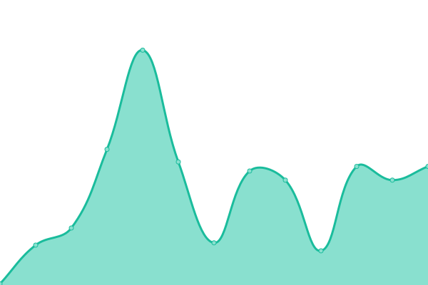
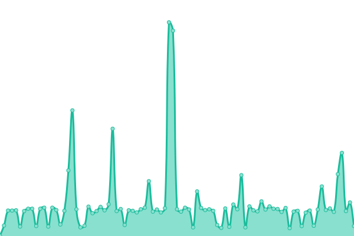
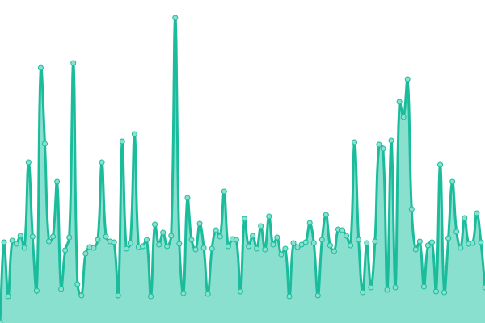

# [📈 Live Status](https://seamapi.github.io/upptime): <!--live status--> **🟧 Partial outage**

This repository contains the open-source uptime monitor and status page for [Seam](https://seam.co), powered by [Upptime](https://github.com/upptime/upptime).

With [Upptime](https://upptime.js.org), you can get your own unlimited and free uptime monitor and status page, powered entirely by a GitHub repository. We use [Issues](https://github.com/seamapi/upptime/issues) as incident reports, [Actions](https://github.com/seamapi/upptime/actions) as uptime monitors, and [Pages](https://seamapi.github.io/upptime) for the status page.

<!--start: status pages-->
<!-- This summary is generated by Upptime (https://github.com/upptime/upptime) -->
<!-- Do not edit this manually, your changes will be overwritten -->
<!-- prettier-ignore -->
| URL | Status | History | Response Time | Uptime |
| --- | ------ | ------- | ------------- | ------ |
|  [Seam API Overall Health](https://connect.getseam.com/health) | 🟩 Up | [seam-api-overall-health.yml](https://github.com/seamapi/upptime/commits/HEAD/history/seam-api-overall-health.yml) | 

 198ms
     
 | 

<a href="https://status.seam.co/history/seam-api-overall-health">100.00%</a>
    

|  [Brivo Login Working on Sandbox Workspaces](https://connect.getseam.com/health/service/brivo.sandbox.login) | 🟥 Down | [brivo-login-working-on-sandbox-workspaces.yml](https://github.com/seamapi/upptime/commits/HEAD/history/brivo-login-working-on-sandbox-workspaces.yml) | 

 340ms
     
 | 

<a href="https://status.seam.co/history/brivo-login-working-on-sandbox-workspaces">0.00%</a>
    

|  [Genie Login Working on Sandbox Workspaces](https://connect.getseam.com/health/service/genie.sandbox.login) | 🟩 Up | [genie-login-working-on-sandbox-workspaces.yml](https://github.com/seamapi/upptime/commits/HEAD/history/genie-login-working-on-sandbox-workspaces.yml) | 

 147ms
     
 | 

<a href="https://status.seam.co/history/genie-login-working-on-sandbox-workspaces">98.86%</a>
    

|  [Akuvox Login Working on Sandbox Workspaces](https://connect.getseam.com/health/service/akuvox.sandbox.login) | 🟩 Up | [akuvox-login-working-on-sandbox-workspaces.yml](https://github.com/seamapi/upptime/commits/HEAD/history/akuvox-login-working-on-sandbox-workspaces.yml) | 

 124ms
     
 | 

<a href="https://status.seam.co/history/akuvox-login-working-on-sandbox-workspaces">99.23%</a>
    

|  [August Login Working on Sandbox Workspaces](https://connect.getseam.com/health/service/august.sandbox.login) | 🟩 Up | [august-login-working-on-sandbox-workspaces.yml](https://github.com/seamapi/upptime/commits/HEAD/history/august-login-working-on-sandbox-workspaces.yml) | 

 168ms
     
 | 

<a href="https://status.seam.co/history/august-login-working-on-sandbox-workspaces">95.92%</a>
    

|  [Linear Login Working on Sandbox Workspaces](https://connect.getseam.com/health/service/linear.sandbox.login) | 🟩 Up | [linear-login-working-on-sandbox-workspaces.yml](https://github.com/seamapi/upptime/commits/HEAD/history/linear-login-working-on-sandbox-workspaces.yml) | 

 116ms
     
 | 

<a href="https://status.seam.co/history/linear-login-working-on-sandbox-workspaces">93.56%</a>
    

|  [Schlage Login Working on Sandbox Workspaces](https://connect.getseam.com/health/service/schlage.sandbox.login) | 🟩 Up | [schlage-login-working-on-sandbox-workspaces.yml](https://github.com/seamapi/upptime/commits/HEAD/history/schlage-login-working-on-sandbox-workspaces.yml) | 

 167ms
     
 | 

<a href="https://status.seam.co/history/schlage-login-working-on-sandbox-workspaces">95.20%</a>
    

|  [Doorking Login Working on Sandbox Workspaces](https://connect.getseam.com/health/service/doorking.sandbox.login) | 🟩 Up | [doorking-login-working-on-sandbox-workspaces.yml](https://github.com/seamapi/upptime/commits/HEAD/history/doorking-login-working-on-sandbox-workspaces.yml) | 

 138ms
     
 | 

<a href="https://status.seam.co/history/doorking-login-working-on-sandbox-workspaces">96.05%</a>
    

|  [Genie Login Working on Production Workspaces](https://connect.getseam.com/health/service/genie.production.login) | 🟥 Down | [genie-login-working-on-production-workspaces.yml](https://github.com/seamapi/upptime/commits/HEAD/history/genie-login-working-on-production-workspaces.yml) | 

 112ms
     
 | 

<a href="https://status.seam.co/history/genie-login-working-on-production-workspaces">46.54%</a>
    

|  [August Login Working on Production Workspaces](https://connect.getseam.com/health/service/august.production.login) | 🟥 Down | [august-login-working-on-production-workspaces.yml](https://github.com/seamapi/upptime/commits/HEAD/history/august-login-working-on-production-workspaces.yml) | 

 242ms
     
 | 

<a href="https://status.seam.co/history/august-login-working-on-production-workspaces">0.00%</a>
    

|  [Schlage Login Working on Production Workspaces](https://connect.getseam.com/health/service/schlage.production.login) | 🟩 Up | [schlage-login-working-on-production-workspaces.yml](https://github.com/seamapi/upptime/commits/HEAD/history/schlage-login-working-on-production-workspaces.yml) | 

 244ms
     
 | 

<a href="https://status.seam.co/history/schlage-login-working-on-production-workspaces">99.88%</a>
    

|  [SmartThings Login Working on Sandbox Workspaces](https://connect.getseam.com/health/service/smartthings.sandbox.login) | 🟥 Down | [smart-things-login-working-on-sandbox-workspaces.yml](https://github.com/seamapi/upptime/commits/HEAD/history/smart-things-login-working-on-sandbox-workspaces.yml) | 

 256ms
     
 | 

<a href="https://status.seam.co/history/smart-things-login-working-on-sandbox-workspaces">74.44%</a>
    

|  [Seam Relay Admin Login Working on Sandbox Workspaces](https://connect.getseam.com/health/service/seam_relay_admin.sandbox.login) | 🟩 Up | [seam-relay-admin-login-working-on-sandbox-workspaces.yml](https://github.com/seamapi/upptime/commits/HEAD/history/seam-relay-admin-login-working-on-sandbox-workspaces.yml) | 

 196ms
     
 | 

<a href="https://status.seam.co/history/seam-relay-admin-login-working-on-sandbox-workspaces">100.00%</a>
    

<!--end: status pages-->

[**Visit our status website →**](https://seamapi.github.io/upptime)

## 📄 License

- Powered by: [Upptime](https://github.com/upptime/upptime)
- Code: [MIT](./LICENSE) © [Seam](https://seam.co)
- Data in the `./history` directory: [Open Database License](https://opendatacommons.org/licenses/odbl/1-0/)
